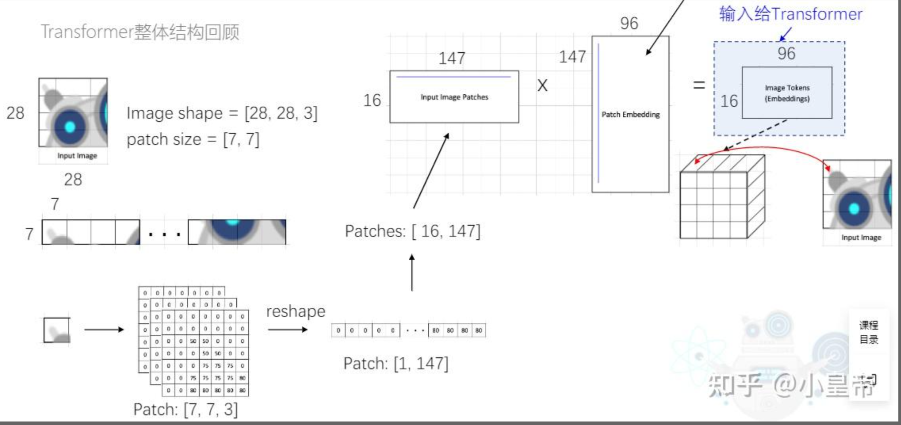
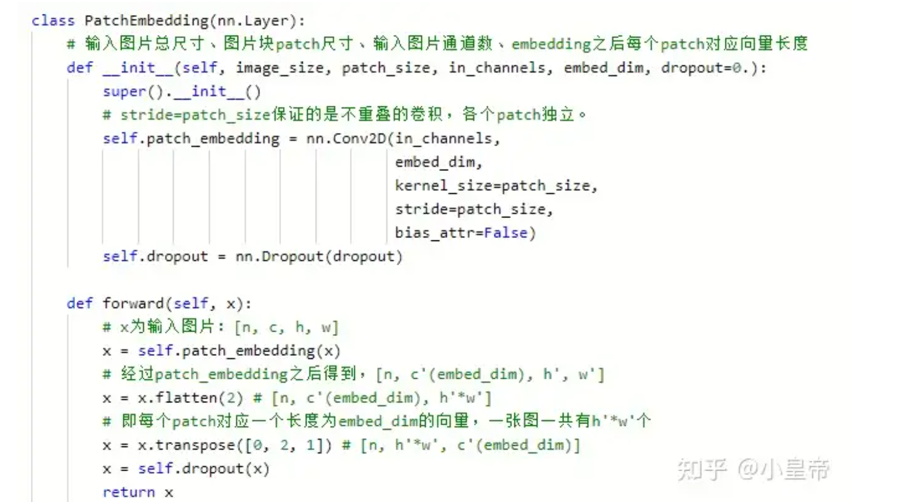
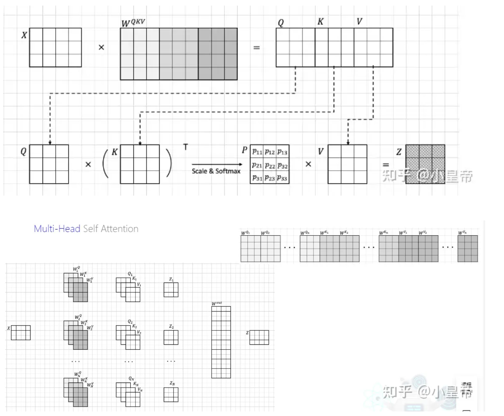
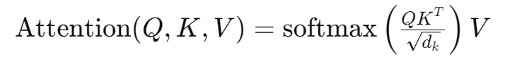
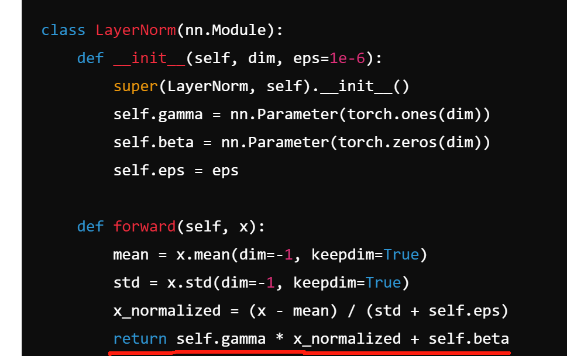

+++

author = "sh"
title = "record"
date = "2024-7-10"
description = "Today's learning "
categories = [
    "Today's learning"
]
tags = [
    "Today's learning"
]

+++


# 想法

现在的问题：1. 以原本追踪的为根底，发现原本在真实值上的值是相差不大，但是实际transt_25的效果还是可以的

2. 现在需要确认的是攻击q,k 点成是否有用，这个得先试一下
3. 为什么siam 的加上注意力机制会变弱呢，真奇怪，代码应该没有写错，可能的猜想是什么，siam 和transt并没有什么这别打的数据，应该就是在处理补丁上transt的防御更好
4. 在测试的时候大小很有问题，感觉需要修改，这个点得确认下，目前选择的是个定值

## 追踪的特点

​	1.推理的过程中，补丁的大小在搜索区域的关系、搜索区域是上一帧的两倍大小，后续帧的在原图上的位置就会变小，这里如果依旧占用0.25 ，那么patch值必定会缩小，不对，如果是本体的那就不会缩小，所以得重新设计

这个后来再统一，追踪的问题


tanst 和mxiformer 的有区别，实际攻击起来会有吗，就是vit 的操作将图片分片的操作，一种是经过cnn先变成了特征，这是否就和补丁的位置有关系了，虽然是注意力的操作，但是在注意力的位置上是否要放置在切片上


## 书写

1. 攻击成功分析添加在论文里，别人写的过程，把真个过程移交到追踪就可以了

​	鲁棒性的验证，分析transformer追踪器的

2. 对于点积注意力，这有效地将所有查询的注意力引导到恶意令牌
3. 聚类图

## 任务

1.攻击的需要测试

2.新的tracker需要写好攻击

3.将原本在攻击要得出个结果，需要在一个siam和transt上

4.明天把能写的解释先都解释了

## patch embedding

将图片的tensor给切割成不同的patches，通过卷积或者flatten 将patches表示为长度为 image tokens 





```
假设图片是【28，28，3】
patches 是【7，7，3，[4*4]】,4*4就是在一张图里的patch的数量
在通过nn.conv2d 将3 转换成embed_dim 
```

## enconder



## u（输入均值）,w（投影矩阵的尺度）,dk(嵌入维度)


u的均值，来自中心化, 就是线性，如果加上非线性就是非中心化

每张图像被分成了很多小块。每个小块被转化为一个特征向量，表示这个小块的颜色、形状等特征。中心化就是把所有这些特征向量的平均值调整到零。中心化让它们在空间中更加均匀分布，处理起来更方便。

wq 和 wk 投影矩阵假设相反系数的注意力权重

 

dk是词向量和隐藏层的维度，用来防止softmax值过大


## 攻击

1.一次性攻击所有的

2.pgd ，内容不够可以尝试这种，然后变成静态的，就是半白盒

3.效果好的话，再加个伪装就行，内容就肯定够了

## 问题

1.grm 的复现卡住了出现了奇怪的问题，应该怎么解决，需要我一点点的想 （已解决）

2.论文理解在u，wq, wk ，和dk 上出现了问题，我不理解这个为什么可以随便修改，在一个模型里应该就是定死的或者在训练中不断优化的

3.论文的返修需要加实验，要加csa类似的我该怎么实现，目前计划的是在otb上实现，不统一的规则有什么好实现的，那就要近可能的去统一，怎么讲嗯，一个只攻击了一张，一个攻击了全部，他的效果更好，我的垃圾，大问题，研究的就很有问题，但我不想要攻击模板，现在第一个想法就是攻击所有的，说是为了统一的情况，这就需要完整的复现。

## 之前论文的问题

1.对比实验的不对，本身在那篇论文上有更多的对比实验，可以先做起来，对所有和对第一个得想 清楚，别的是仅对模板，又有攻击效果。

针对这个问题，如果要改进的话，就得也做个2023的那个实验，有篇aba 和 iou ，可以不管攻击的是所有帧还是什么，就用整个表来放就可以了差的就差的，也就要复现个2023的

这个问题不管了，但是估计后面还是会有这个问题，先想想吧

## 论文复现疑惑

1. 目前理解的修改的地方是一个条目，即使一维度的嵌入，我理解的就是坐上角的一个小块，这个不知道有没有印象，转化的这里比方说一定要是个整数，就是由图片到embedding的过程、就是一个小块对应的embedding维数大小

2. 0.95 和 0.99 这两个数据是直接估算的吗，不清楚是哪里来的

   现在理解的就是最终的权重大于0.99 ，以及embedding_dim 行里有95%是存在权重大于0.99

3. 自己设置的q和k的意义，不清楚，在目标分类中不是由模型来定的吗，给它设置成相反值有什么意义

4. 理解的是修改的行，最终会反应到A值得列的位置，需要实现的就是修改后的最大。现在在追踪上就会有问题，自注意力和交叉注意力，突然想到，这里的攻击，应该是使得补丁位置的权重更大吗，不对，那就要把补丁放在角落，但是效果不确定好

5. 在分类的时候可以将补丁放在左上角使得注意力偏向左上角，使得对这部分的关注大，导致失误吗，在追踪上就不能这么实现，也不确定，直接使用的时候没有效果，但是不一定，因为破坏的是点积的

6. 又想到了损失里面的双重损失，使得周边置信度变大，之前直接测没有用，我猜测的是对中间的补丁影响不到周边，但加了个对点积的，会不会不一样。

7. u应该还是归一化的部分

8. 查询簇和值的簇如如何画图，结果为什么会在两块，显示的结果没有相接的部分

9.  点积注意力的输入通常不居中（零均值），这是由于在自注意力之前的归一化层内启用了仿射变换，这里的仿射变换就是在nn.LayerNorm过程中，如下：

   

10. 

    

## Transformer结构在分类中的作用

1. Transformer 转化的嵌入空间以及后续的注意力权重是如何对分类结果产生影响的，分类中q和k的相似有什么用，softmax函数将这些相似度转化为注意力权重。最后，这些注意力权重乘以相应的value token，决定了模型对每个人的关注程度

​	2. 在vision transformer 里图片的一个patch size 转化成一个token

## 论文内容

1. 之前都是关注对vaule token 进行修改，而不是对注意力权重进行修改
1. 追踪与这个最大的区别就再对比上，模板和搜索区域的对比


## softmax的饱和效应

1.由于softmax的饱和效应，某些查询和键之间的点积值非常大，这使得softmax函数输出的注意力权重几乎固定。意味着这些注意力权重的梯度非常小，模型很难通过这些梯度信息来调整对不同人物的关注分布。

在反向传播过程中，我们会计算损失函数对每个注意力得分 zi的梯度。而这个梯度会通过Softmax函数反向传播到注意力得分。Softmax函数的梯度公式为：

∂zj∂ai={ai(1−ai),−aiaj,if i=jif i\\=j

这意味着对于每个 zi，它的梯度不仅与自己相关，还会受到其他 zj 的影响。特别是，Softmax函数会导致以下两个关键影响：

1. **梯度缩放效应**：当 zi的值较大或较小时，Softmax输出的注意力权重 ai可能会接近0或1。在这种情况下，ai(1−ai)的值会变得非常小，导致梯度变得很小。
2. **互相抵消**：由于Softmax的归一化特性，注意力得分之间的梯度会相互抵消。例如，如果 ai已经很大（接近1），则其他权重 aj将非常小（接近0），因此 zj对 zi的反向传播影响也会很小。

## 点击注意力作用

点积注意力计算查询令牌与所有关键令牌的点积相似度，稍后使用softmax运算符对其进行归一化以获得每个令牌的注意力权重。然后将这些注意力权重与价值令牌相乘，以控制价值令牌在注意力块中的贡献。


## 书写文字

1.点积注意力计算查询令牌与所有关键令牌的点积相似度，稍后使用softmax运算符对其进行归一化以获得每个令牌的注意力权重。然后将这些注意力权重与价值令牌相乘，以控制价值令牌在注意力块中的贡献。因此，具有标准对抗性目标的基于梯度的攻击偏向于集中于通过值令牌传播的对抗性效果，并且对注意力权重引入很少或不引入对抗性效果，从而限制了攻击的潜力.(修改后，可用来解释的地方)。

**际应用中的设置**：在训练好的图像Transformer中，通常设计有较大的嵌入维度 dkd_kdk，并且由于在自注意力之前的归一化层中启用了仿射变换，输入通常不是零均值。这些条件使得点积注意力机制在实际应用中可能更容易受到对抗性补丁攻击的影响。

**其他实现细节**：一些实现使用仿射变换而不是线性投影，这会导致键和查询在投影时出现不同的偏置，类似于非中心化输入的效果。这进一步增加了对抗性攻击的脆弱性。


**Softmax后的梯度变小**：当你在反向传播中计算梯度时，如果目标是修改输入以最大化或最小化这些注意力权重，由于Softmax的性质，计算得到的梯度值会很小。这意味着基于这些梯度的对抗性攻击（例如PGD）在尝试利用这一机制的脆弱性时，效果可能会受到限制。

## 书写内容

1. 可以同样再交叉注意力上进行研究，聚类图之类的
2. 可以尝试聚类分析的方式
3. 可以分析下四种注意力的聚类图
4. 解释对value攻击不行的原因
5. 可以分析下不对应patch的攻击会怎么样，不知道有没有弄过，在追踪的场景下，应该没有，那我应该怎么写，可以作为一块内容但是有问题，如何分析呢，不太现实 ，只能从大小进行修改 (文中有进行不同大小的，所以不一定匹配)
6. 有了注意力了自然要做没有的，中心的和其他位置和注意力的，在边缘的无效果，也可以做出来，追踪的特殊再模板与搜索的对比
7. token到图上的解释还可以画，和give me 这篇类似
8. 然而，简单地在所有磁头和层上平均Lhl kq可能不是最佳的，因为它可能总体上有利于许多较小的磁头方向的改变，而不是在更大程度上成功地欺骗磁头和层的子集。
9. 补丁大小不同的消融实验
10. 以一个追踪器的不同大小模型为例子，然后扩充下
11. 对抗补丁的有目标
12. 它的可以任意的地方，是我疑惑的地方，我尝试的是不能的

## 今日任务

1. 设想的是看看注意力这个怎么和如今的跨token进行修改，以及原有的再角落使得这部分的注意力最高和现在的再注意力最高处，对补丁需要如何修改。总共这么两个问题。

## 损失函数内容

1.思想是使得补丁位置的点击相似度最大，但是不适应追踪


## 别人的结果好的问题

1. 一个可能是迭代更新的问题，这个得弄清楚


## 大论文

1.第一块还是要加上其他的对比，这个得改
